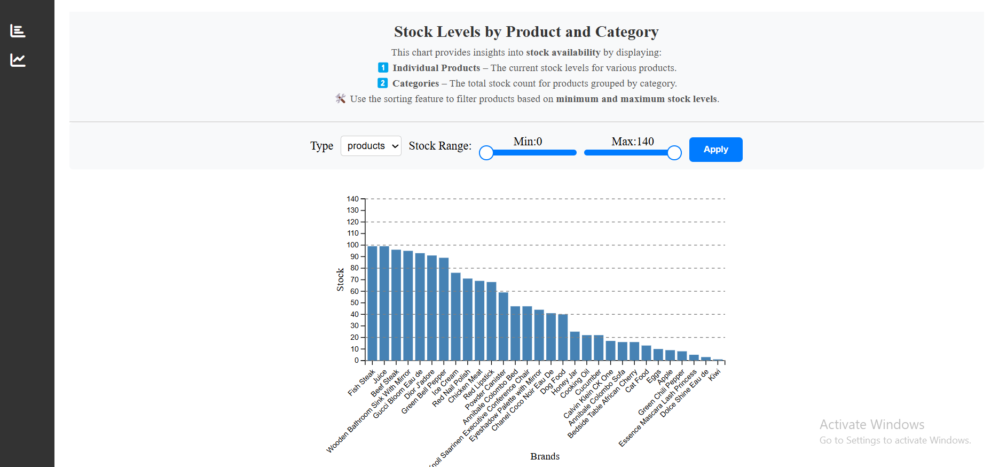

# 📊 D3.JS-Dashboard

## 🚀 Overview

This project is an interactive **D3.js-powered dashboard** that visualizes product data using **bar and line charts**. The dashboard includes **"Stock Levels by Product and Category"** and **"Product Ratings vs. MOQ & Discount Trends."**  
The data is fetched from a dummy API and visualizes **stock levels by products and categories**, as well as **how product ratings vary with discounts and MOQ of products.**

---

## 🛠 Tech Stack

- **Angular** (Framework)
- **D3.js** (Data visualization)
- **TypeScript** (Scripting)
- **Bootstrap** (Styling)

---

## 🔧 Installation & Setup

1. **Clone the repository:**

   ```sh
   git clone https://github.com/SalahNanminda/D3.JS-Dashboard.git
   cd D3.JS-Dashboard

   ```

2. **Install dependencies:**

   ```sh
   npm install
   ```

3. **Start the application:**

   ```sh
   ng serve
   ```

4. **Open in browser:**

   ```sh
   http://localhost:4200/
   ```

---

## 📡 API Integration

**The dashboard fetches product data from a dummy API:**

```sh
https://dummyjson.com/products
```

---

## 📌 Features

- 📊 **Bar Chart:** Visualizes stock levels by product and category.
- 📈 **Line Chart:** Displays product ratings in relation to MOQ & discounts.
- 🔍 **Interactive Filtering:** Filter products and categories based on a selected stock range.
- 🏷 **Interactive Data Tooltip:** Displays detailed product information (**name, MOQ, and rating**) when hovering over each node in the Line chart.
- 📡 **API Fetching:** Fetches data from the API

---

## 📁 Project Structure

/src/app  
├── components/  
│ ├── bar-chart/  
│ ├── line-chart/  
├── Models/  
│ ├── BrandStock/  
├── services/  
│ ├── Api.service.ts  
├── app-routing.module.ts  
├── app.module.ts

---

## 🖼 Screenshots

1.**Stock Levels by Product and Category**
 2.**Product Ratings vs. MOQ & Discount Trends**

